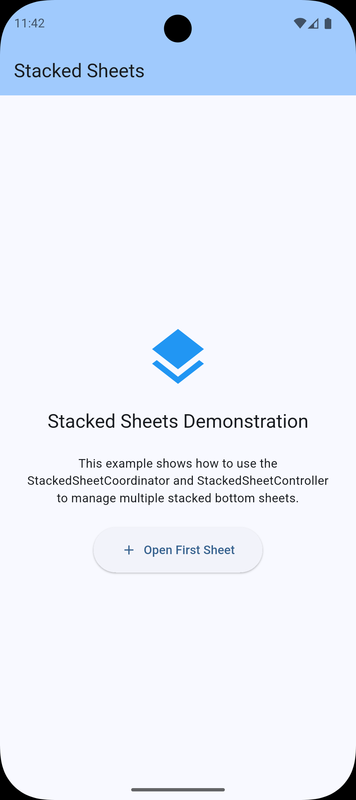
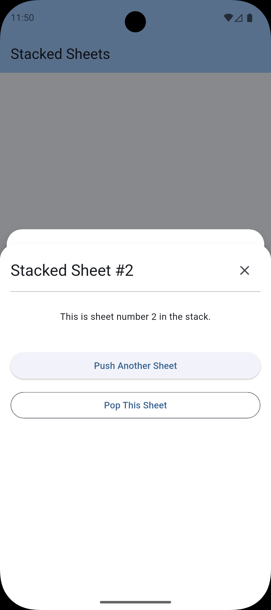
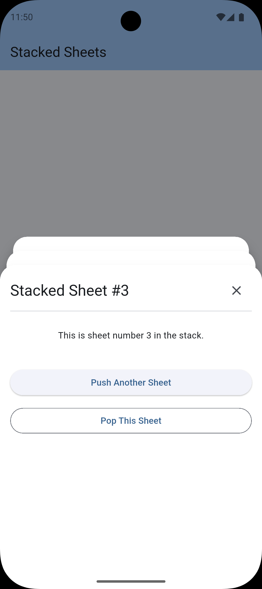

# Stacked Sheets 📚

[](https://pub.dev/packages/stacked_sheets)
[](https://opensource.org/licenses/BSD-3-Clause)

An advanced, overlay-driven bottom sheet stack for Flutter. Create fluid, multi-layered experiences with automatic 3D parallax scaling and elegant transitions.

## 📸 Screenshots

| Initial State | Single Sheet | Multiple Sheets |
| :---: | :---: | :---: |
|  |  |  |

## ✨ Features

*   **Layered Stacking:** Push multiple bottom sheets on top of each other.
*   **Parallax Scaling:** Background sheets automatically scale down and dim as new layers are added, creating a beautiful depth effect.
*   **Overlay-Based:** Built on Flutter's Overlay system, so it doesn't interfere with your Navigator routes.
*   **Highly Customizable:** Control background colors, border radius, and initial extents for each individual sheet.
*   **Controller Driven:** Manage your sheet stack from anywhere in your code using a simple `ChangeNotifier` based controller.

## 🚀 Getting started

Add `stacked_sheets` to your `pubspec.yaml`:

```yaml
dependencies:
  stacked_sheets: ^0.0.1
```

Or run:
```bash
flutter pub add stacked_sheets
```

## 🛠 Usage

### 1. Setup the Coordinator

Wrap your main application widget (usually the one containing your `Scaffold`) with the `StackedSheetCoordinator`.

```dart
final controller = StackedSheetController();

@override
Widget build(BuildContext context) {
  return StackedSheetCoordinator(
    controller: controller,
    child: Scaffold(
      appBar: AppBar(title: Text('My App')),
      body: Center(
        child: ElevatedButton(
          onPressed: () => _showSheet(),
          child: Text('Open Sheet'),
        ),
      ),
    ),
  );
}
```

### 2. Push a Sheet

Use the controller to push a new `StackedSheet`.

```dart
void _showSheet() {
  controller.push(
    StackedSheet(
      initialExtent: 0.7,
      backgroundColor: Colors.white,
      borderRadius: BorderRadius.vertical(top: Radius.circular(24)),
      child: Padding(
        padding: const EdgeInsets.all(16.0),
        child: Column(
          children: [
            Text('Hello Stacked Sheet!'),
            ElevatedButton(
              onPressed: () => controller.pop(),
              child: Text('Close'),
            ),
          ],
        ),
      ),
    ),
  );
}
```

### 3. Controller Actions

The `StackedSheetController` provides several methods to manage the stack:

| Method | Description |
| --- | --- |
| `push(StackedSheet)` | Adds a new sheet to the top of the stack. |
| `pop()` | Removes the topmost sheet. |
| `clear()` | Closes all open sheets at once. |
| `sheets` | Access the current list of active sheets. |

## 🎨 Customization

The `StackedSheet` model allows for per-sheet customization:

```dart
StackedSheet(
  child: MyWidget(),
  initialExtent: 0.8, // 0.0 to 1.0 (80% of screen height)
  dismissible: true,   // Allow dismissal (WIP)
  backgroundColor: Colors.grey[100]!,
  borderRadius: BorderRadius.circular(12),
);
```

## 📂 Example

Check out the [example](https://github.com/your_username/stacked_sheets/tree/main/example) folder for a full implementation demonstrating multiple layers and interactive triggers.

## 🤝 Contributing

Contributions are welcome! If you find a bug or have a feature request, please open an issue.

## 📜 License

This project is licensed under the BSD 3-Clause License - see the [LICENSE](LICENSE) file for details.
